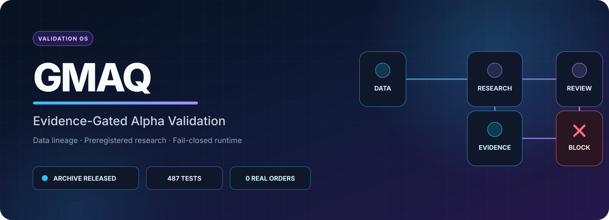
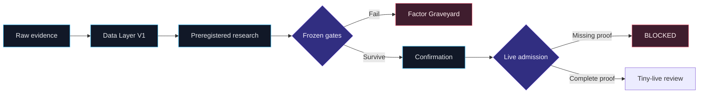

<p align="center">
  
</p>

<p align="center">
  <a href="https://github.com/jojo232386/global-quant/actions/workflows/ci.yml"></a>
  
  
  
  
</p>

<p align="center"><strong>An evidence-gated research and risk system for deciding which strategies deserve capital.</strong></p>

GMAQ combines point-in-time data controls, preregistered research, adversarial review, and a fail-closed Freqtrade runtime. It verifies whether each result survives data lineage checks, realistic costs, holdout evidence, and operational identity binding.

> [!IMPORTANT]
> GMAQ Validation Archive v2 passed its frozen portable release contract. V1 passed locally and failed GitHub CI portability because five checks require an external immutable data warehouse; the project preserved that failure and created v2 under a new contract. This repository makes no profitability or live-readiness claim.

## Closeout in one screen

| Measure | Verified closeout |
| --- | --- |
| Project role | Alpha validation and quant risk governance |
| Validation Archive v2 | `ARCHIVE_RELEASED` |
| Critical fail-closed controls | `109 passed` |
| Promoted Alpha | `0` |
| Ready for strategy deployment | `NO` |
| Ready for tiny live | `NO` |
| Real orders | `0` |
| Portable contract suite | `482 passed`; 5 named external-data checks |
| Full local collection | `487 passed` with immutable warehouse present |
| Canonical closeout | `main@db45f4e9` |

GMAQ revoked weak historical passes, stopped process-defective runs before performance, and rejected candidates whose edge disappeared under point-in-time or cost controls. No unsupported result reached a capital path.

## System map



## What the system enforces

| Layer | Evidence contract |
| --- | --- |
| Data | Immutable snapshots, file hashes, schemas, PIT instrument identity, lifecycle checks |
| Research | Preregistration, cost stress, train/OOS/holdout separation, no parameter rescue |
| Program governance | Multiple-testing history, independent review, Factor Graveyard |
| Runtime | Dry-run default, credential rejection, reconciliation, audit continuity, kill controls |
| Admission | Exact Git/config/data/soak identity; synthetic or caller-authored PASS claims stay blocked |

## Evidence that changed the decision

- **Point-in-time reconstruction overturned attractive results.** Two cross-sectional passes depended on a present-day universe and concentrated outliers. PIT replay removed the promotion case.
- **Holdout gates closed EXPL-017.** The frozen formal run retained attractive intermediate behavior, then failed final holdout, stress, regime, and concentration requirements. The team recorded `HYPOTHESIS_FAIL` and prohibited a rerun.
- **Native strategy semantics exposed a screening flaw.** The OSS review examined 8 repositories, 30 strategy files, and 5 shortlisted candidates. GMAQ admitted none because its daily/PIT/vectorbt contract changed or excluded the original Freqtrade semantics. That result drove the successor design toward native-framework screening.

Read the [v2 release contract](docs/ARCHIVE_RELEASE_V2.md), inspect its [machine-readable PASS result](results/gmaq-validation-archive-v2.json), or open the full [engineering case study](docs/CASE_STUDY.md). The [v1 result](results/gmaq-validation-archive-v1.json) preserves the portability failure.

## Repository guide

| Path | Purpose |
| --- | --- |
| [`research/backtests/`](research/backtests/) | Preregistrations, manifests, immutable results, verdicts |
| [`research/exploration/`](research/exploration/) | Cheap screens, formal freezes, Factor Graveyard |
| [`research/process/`](research/process/) | Research tiers, program history, data capability reviews |
| [`gmaq_data/`](gmaq_data/) | Snapshot creation and deterministic verification |
| [`gmaq_live/`](gmaq_live/) | Non-ordering, fail-closed admission contracts |
| [`control_room/`](control_room/) | Local read-only evidence dashboard |
| [`configs/`](configs/) | Cost, control-plane, soak, and live-readiness contracts |
| [`tests/`](tests/) | Data, research, runtime, security, and admission contracts |

## Reproduce the archive

The CI workflow pins the dependency set by hash and reproduces the released result on Python 3.12.

```sh
uv venv --python 3.12 /tmp/gmaq-venv
uv pip sync --python /tmp/gmaq-venv/bin/python \
  research/oss/requirements-vectorbt-poc.txt
/tmp/gmaq-venv/bin/python scripts/gmaq-verify-archive \
  --check results/gmaq-validation-archive-v2.json
```

The verifier checks immutable evidence, forces localhost tests away from desktop HTTP proxies, runs 109 critical controls, and validates the 487-test collection in either warehouse-present or repository-portable mode. Portable mode accepts only five named external-data skips and rejects every other skip. The repository needs no exchange credentials for verification.

## Design decisions

- GMAQ preserves failed experiments and frozen contracts instead of rewriting history after results arrive.
- The runtime starts in credential-free dry-run mode and keeps live admission structurally blocked until independent exchange evidence exists.
- Legacy research engines remain available for historical replay. They cannot create new formal evidence.

The project’s closeout informed a separate Freqtrade-native successor: screen public strategies in their original framework, then send the small survivor set into strict confirmation.

## Safety and scope

GMAQ contains no live configuration or enabled order path. Account evidence, credentials, and runtime state stay outside Git. The repository is research software, not financial advice.
